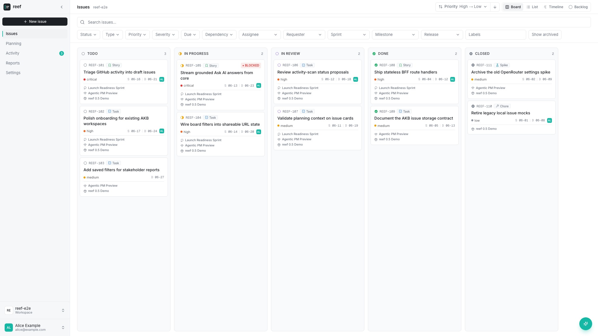

# reef

> Agentic, AKB-backed issue tracking that keeps issues, plans, and reports in
> sync with what developers and coding agents actually do in your GitHub repos.

reef is an AKB subproject and reference product. It shows how AKB can be the
durable workspace behind an agentic application: documents for human-readable
knowledge, tables for queryable product state, HTTP APIs for the web app, and an
agent-friendly data model that coding agents can operate on.

In reef, that AKB-backed workspace becomes issue tracking for teams using GitHub
and coding agents. reef reads monitored repositories, compares that evidence
with the team's AKB issue workspace, and proposes draft issues, status
transitions, and grounded AI answers. People stay in control: AI enrichment,
activity-scan drafts, and status changes are suggestions until a user approves
them.

> **Stability:** reef is currently a pre-1.0 reference product. Until a 1.0
> release, user-facing workflows, storage shape, API responses, and deployment
> behavior may change in breaking ways between minor releases. Breaking changes
> are called out in the [Changelog](CHANGELOG.md); see the
> [Release policy](docs/release-policy.md) for details.



## What reef shows about AKB

- **AKB can back a full product surface.** reef stores workspaces, issue bodies,
  planning data, templates, settings, and membership in AKB while keeping the
  current/default web tier stateless. A future auth-v2 cutover may add encrypted
  Redis custody for OIDC credentials only; it does not move product state out of
  AKB.
- **Documents and tables work together.** Issue bodies live as AKB task
  documents, while board/list/report fields live in typed `reef_issues` rows.
- **Agentic workflows can stay reviewable.** Enrichment and activity detection
  show their rationale before changing issue fields, so the human remains the
  author and decision maker.
- **Project state can follow real work.** reef reads commits, pull requests,
  branches, and code search results from monitored GitHub repositories to
  identify work that moved forward or was never tracked.
- **Credentials stay out of browser storage.** The AKB session is an httpOnly
  cookie, and GitHub access is read-only through a deployment-managed GitHub App
  rather than a browser-stored token.

## Try reef locally

reef requires Node.js 24.15+ and pnpm 11. The root `.node-version` pins the
exact Node.js 24.18.1 runtime, and the root `packageManager` field pins the
exact pnpm version; run `corepack enable` before installing so your shell uses
those versions.

### UI preview

For a quick UI preview, you can run reef against the hermetic fixture harness.
It exercises reef-web and its Route Handlers for real while replacing AKB,
OpenRouter, and GitHub with local fixtures:

```bash
pnpm install --frozen-lockfile
pnpm --filter @reef/web run dev:e2e -- demo_board
```

Open [http://localhost:7353](http://localhost:7353), sign in with
`alice` / `password`, and select `reef-e2e`.

To reset the fixture while `dev:e2e` is running:

```bash
pnpm --filter @reef/web run reset:e2e -- demo_board
```

### Source development

For development against a real AKB backend, create the web environment file and
point reef at the backend:

```bash
cp packages/web/.env.example packages/web/.env.local
pnpm dev
```

By default, `packages/web/.env.local` points `AKB_BACKEND_URL` at
`http://localhost:8000`. See [Development with AKB](#development-with-akb) when
you want a real AKB-backed workspace.

### Docker

To try the production-style reef-web container against a reachable AKB backend,
build the image and run it on port `3000`:

```bash
docker build -t reef-web:local .
docker run --rm -p 3000:3000 \
  -e AKB_BACKEND_URL=http://host.docker.internal:8000 \
  reef-web:local
```

Open [http://localhost:3000](http://localhost:3000). If AKB runs in the same
Docker Compose network as reef-web, use the AKB service name in
`AKB_BACKEND_URL` instead, for example `http://akb-backend:8000`. Add
`REEF_PUBLIC_ORIGIN=http://localhost:3000` when testing AKB-delegated SSO
locally.

AI is optional. To enable it, pass `REEF_LLM_API_KEY`, `REEF_LLM_BASE_URL`,
and `REEF_LLM_MODEL` together; the endpoint can be OpenRouter or any compatible
akb-platform gateway. Leaving all three unset keeps AI disabled.

## What reef includes

| Surface | What it provides |
| --- | --- |
| Issues | Board, list, timeline, backlog, detail editing, relations, labels, and filters. |
| Activity Hub | Reviewable draft issues and status-change proposals inferred from monitored repo activity. |
| Ask AI | Read-only, code-grounded answers about the workspace and monitored repositories. |
| Planning and reports | Planning catalog, release/milestone/sprint context, health summaries, and risk views. |
| Workspace settings | Workspace membership, monitored repositories, preferences, and deployment status. |

## Repository layout

This is a public pnpm monorepo. The root `package.json` is the single product
version source of truth; the workspace packages are private and consumed only
inside this repository.

| Path | Purpose |
| --- | --- |
| `packages/core` | Framework-agnostic TypeScript library (`@reef/core`) for schemas, models, AKB access, observability, and errors. |
| `packages/web` | Next.js App Router application package (`@reef/web`) and AKB-facing Backend-for-Frontend. The current/default profile is stateless; the reserved future auth-v2 profile adds encrypted Redis custody for OIDC credentials only. Its server-only adapters own GitHub/LLM I/O and its application tree owns agents; Route Handlers remain thin. |
| `packages/orchestration/runtime` | Provider-neutral execution core (`@reef/orchestrator`) for registry preflight, lifecycle, cancellation, cleanup, terminal results, and graceful shutdown outside the web process. |
| `packages/orchestration/cli` | Private foreground work-URI invocation adapter (`@reef/orchestration-cli`) for strict config resolution, controller binding, bounded progress, cancellation, and terminal results. |
| `packages/orchestration/providers/codex` | Private Codex App Server harness adapter (`@reef/harness-provider-codex`) for stdio lifecycle, policy enforcement, and secret-free harness events. |
| `packages/orchestration/providers/local` | Private local infrastructure provider (`@reef/infrastructure-provider-local`) for isolated Git-backed run workspaces and bounded process execution. |
| `packages/orchestration/providers/local-validation` | Private local validation provider (`@reef/validation-provider-local`) for ordered trusted checks, bounded redacted proof, and process-tree cleanup. |
| `packages/jira-migrator` | Operator-run Jira-to-Reef migration package (`@reef/jira-migrator`) for read-only Jira discovery, private migration artifacts, import planning, and dependency-injected Reef apply/reconciliation. |
| `packages/orchestration/providers/reef` | Private Reef work adapter (`@reef/work-provider-reef`) that implements the orchestrator `WorkProvider` contract through core's AKB issue and activity funnels. |
| `docs/` | Architecture, package contracts, UX, deployment, migration, release, and maintenance documentation. |
| `deploy/` | Kubernetes deployment assets. |
| `scripts/` | Repository automation, including release-policy and maintenance checks. |

Package-local engineering rules live in each workspace package's `AGENTS.md`.

## Development with AKB

reef stores workspaces, issue documents, and `reef_issues` rows in
[AKB](https://github.com/dnotitia/akb). reef does not bundle AKB; it reaches a
running AKB backend over HTTP through `AKB_BACKEND_URL`.

For local development with real data, run or port-forward an AKB backend, copy
`packages/web/.env.example` to `packages/web/.env.local`, and set
`AKB_BACKEND_URL` to that backend. The `@reef/web` README covers the detailed
local setup; the deployment guide covers production environment variables,
Kubernetes, Docker, and SSO.

## Common commands

Run these from the repository root.

| Command | What it does |
| --- | --- |
| `pnpm dev` | Start the web app on [http://localhost:7333](http://localhost:7333). |
| `pnpm build` | Build the web app and its workspace dependencies for production through Turbo. |
| `pnpm build:packages` | Discover every buildable Node workspace package and emit its artifact under `dist/`. |
| `pnpm build:affected` | Build only changed workspaces and their downstream dependents when Git history is available. |
| `pnpm check:turbo-contract` | Prove the discovered Turbo graph, cache inputs/outputs, invalidation, and affected/downstream selection. |
| `pnpm package-contract:smoke` | Pack every discovered buildable artifact, install it in an isolated consumer, and exercise its public imports and CLI. |
| `pnpm architecture:check` | Check dependency cycles, resolution, production/test boundaries, and workspace directions. |
| `pnpm lint` | Run the repository Biome check through the canonical Turbo root task. |
| `pnpm format` | Run `biome format --write .`. |
| `pnpm typecheck` | Run `tsc --noEmit` in every workspace package after its build dependencies. |
| `pnpm test` | Run every workspace package's Vitest and package behavior checks. |
| `pnpm check:release` | Enforce release-policy and changelog rules. |

The standard non-E2E gate is:

```bash
pnpm run check
```

See [Package contracts](docs/package-contracts.md) for the artifact and
workspace-boundary contract. The Playwright E2E suite remains a separate
required gate.

## Architecture at a glance

reef has three runtime tiers:

- **AKB** stores workspaces, issue documents, issue rows, templates, planning
  data, and settings.
- **reef core** is the framework-agnostic domain package, published inside the
  workspace as `@reef/core`. It owns schemas, domain models, the AKB adapter,
  observability, and typed errors. It is the only product owner of AKB I/O.
- **reef web** is the Next.js application package, named `@reef/web` in the
  workspace. It renders the product UI and acts as the AKB-facing
  Backend-for-Frontend. The current/default profile is stateless; the
  explicitly enabled auth-v2 route set adds encrypted Redis custody for OIDC
  credentials only.
  Its server-only tree owns GitHub/LLM adapters and agent application code.

Provider-neutral one-run execution lives separately in `@reef/orchestrator`; a
caller may schedule it outside the web process. The private
`@reef/validation-provider-local` adapter supplies exact-checkout validation
proof without owning scheduling or persistence. One-shot Jira migrations run
separately in `@reef/jira-migrator`, while Reef issue work is exposed through
`@reef/work-provider-reef`; neither runtime loop is hosted inside reef web.

For the full boundary, storage, credential, and streaming contracts, read
[docs/architecture.md](docs/architecture.md).

## Deployment

The root `Dockerfile` uses the repository-pinned Turbo dependency to prune the
`@reef/web` workspace, builds its Next.js standalone output on Node 24, and
runs it as a non-root user. Kubernetes manifests live under `deploy/k8s`.

Production deployments provide `AKB_BACKEND_URL` and deployment-managed LLM
environment variables server-side. The current/default SSO path is delegated
through AKB; the auth-v2 flag enables only its separately routed future profile
and must remain disabled until AKB's v2 contract is live. See
[docs/deployment.md](docs/deployment.md) and
[docs/keycloak-sso.md](docs/keycloak-sso.md).

## Documentation

- [Architecture](docs/architecture.md)
- [UX design](docs/ux-design.md)
- [Deployment](docs/deployment.md)
- [Keycloak SSO deployment contract](docs/keycloak-sso.md)
- [Release policy](docs/release-policy.md)
- [Migration policy](docs/migration-policy.md)
- [Jira migration](docs/jira-migration.md)
- [Maintenance](docs/maintenance.md)
- [Core package README](packages/core/README.md)
- [`@reef/web` package README](packages/web/README.md)
- [`@reef/orchestrator` package README](packages/orchestration/runtime/README.md)
- [`@reef/orchestration-cli` package README](packages/orchestration/cli/README.md)
- [`@reef/harness-provider-codex` package README](packages/orchestration/providers/codex/README.md)
- [`@reef/infrastructure-provider-local` package README](packages/orchestration/providers/local/README.md)
- [`@reef/validation-provider-local` package README](packages/orchestration/providers/local-validation/README.md)
- [`@reef/jira-migrator` package README](packages/jira-migrator/README.md)
- [`@reef/work-provider-reef` package README](packages/orchestration/providers/reef/README.md)
- [Contributing](CONTRIBUTING.md)
- [Security policy](SECURITY.md)
- [Changelog](CHANGELOG.md)

## About `REEF-XXX` ids

`REEF-XXX` ids in commit messages, changelog entries, or docs reference
Dnotitia's internal reef instance and do not resolve as public GitHub issues.
They are not required for external contributions.

## License

Apache-2.0. See [LICENSE](LICENSE).
