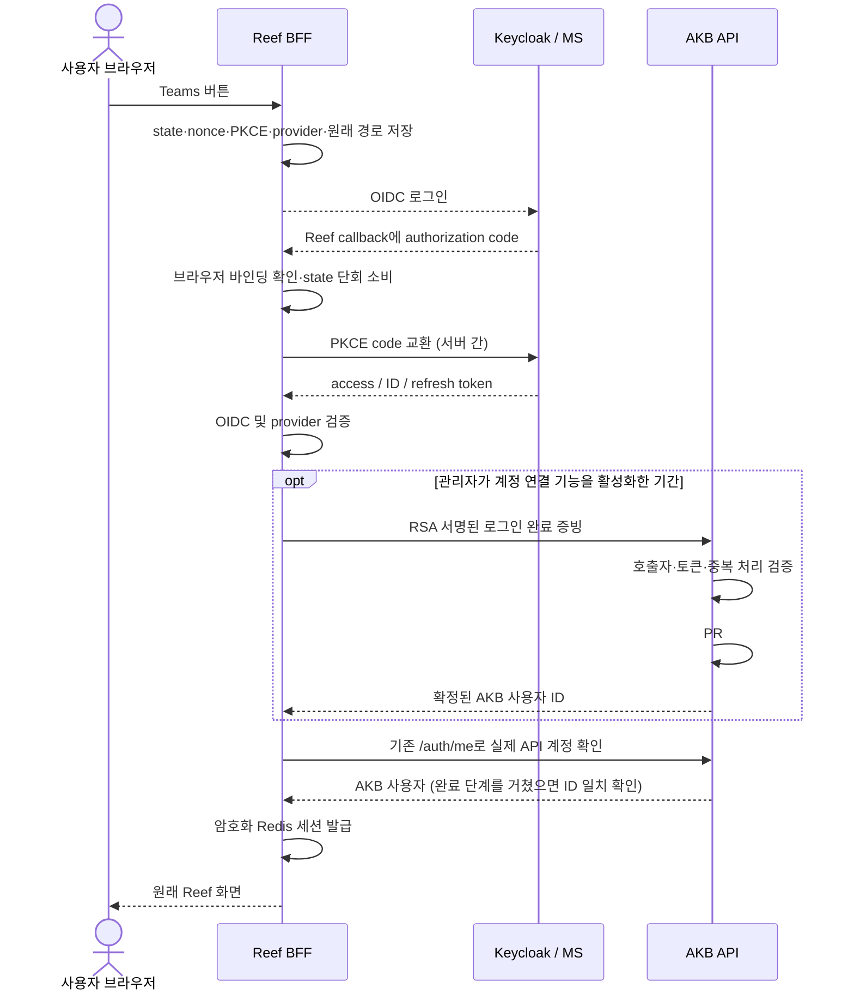

# Reef Teams 로그인 — Reef callback과 AKB 서버 간 계정 연결

상태: Reef와 AKB 구현 완료, 운영 배포 전.
서명 계약과 적용 순서는 [배포 문서](../deployment.md#teams-account-linking-during-reef-sign-in)에 있다.
필수 사용자 조건: 브라우저는 Reef → Keycloak/MS → Reef callback으로만 이동한다.
AKB 화면, AKB 호스트 redirect, 추가 연결 버튼, 두 번째 OIDC 로그인은 없다.

## 결정

Reef는 지금처럼 OIDC client/BFF로 로그인 시작, code 교환, 검증과 Reef 세션을 소유한다.
AKB는 계정 authority로서 명시적인 companion 로그인 완료 API에서 연결·가입을 처리한다.
이 API는 명시적으로 등록·인증된 companion 서버가 호출하며 일반 bearer 토큰만으로는 호출할 수 없다.
PR #531의 공통 계정 서비스를 재사용하고 일반 /auth/me, REST/MCP, PAT의 authority는
확장하지 않는다. AKB 자체 브라우저 로그인은 기존 callback을 계속 사용한다.

계정 연결·가입은 관리자가 필요할 때 활성화하는 선택 기능이다. 기존
`REEF_AKB_LOGIN_AUDIENCE`, `REEF_AKB_LOGIN_KEY_ID`, `REEF_AKB_LOGIN_PRIVATE_KEY`를
모두 설정하면 활성화하고, 모두 미설정/빈 값이면 일반 SSO만 사용한다. 새 토글은 추가하지 않는다.
일부만 설정하거나 잘못 설정하면 새 로그인은 실패하며 일반 경로로 조용히 전환하지 않는다.
연결된 계정의 일반 SSO는 RSA 키와 완료 API 없이 `/auth/me`로 계정을 확인한다.
연결 기능을 켜 둔 기간에는 이미 연결된 계정을 포함한 모든 callback이 완료 API를 사용한다.

이는 표준 OIDC 로그인 위에 추가하는 AKB 계정 등록 계약이다. OIDC에 이미 정의된
endpoint나 PR #531에 이미 허용된 경로라고 주장하지 않는다. 새로운 신뢰 관계는
“등록된 Reef BFF가 자신의 browser-bound 로그인 검증을 수행한다”는 명시적 위임이다.

## 흐름

AKB는 브라우저의 요청 목적지가 아니다. 다이어그램의 AKB 호출은 모두 Reef 서버의
HTTPS 요청이다. 최초에 Reef가 이미 수행하는 AKB auth/config 조회도 그대로 가능하다.
로그인 가용성을 AKB와 완전히 분리하는 작업은 범위에 포함하지 않는다.

## 자동 바인딩이 일어나는 위치

기존 Reef callback의 accountValidator는 /auth/me만 호출하여 미연결 계정이 거부됐다.
연결 기능을 활성화한 경우에만 OIDC 검증 성공과 /auth/me 사이에 명시적인
completeCompanionLogin 단계를 추가한다. 실패한 /auth/me의 일반 401을 미연결 상태로
간주하거나, 이를 계기로 완료 API를 재시도하지 않는다.

AKB 내부:
1. 검증된 (issuer, subject)의 기존 identity가 있으면 그 계정의 상태를 확인한다.
2. 없으면 허용 client/provider와 authoritative email domain/verified-email 정책을 적용한다.
3. 해당 이메일의 유일한 활성 human local 계정이 있으면 그 users.id에 identity를 연결한다.
4. 계정이 없으면 기존 enrollment 정책에 따라 신규 생성한다.
5. 충돌, suspended/service/recovery, 모호한 이메일 후보는 기존 규칙으로 거부한다.

PR #531의 subject/address 잠금, pending 정리, audit, 기존 PAT/Vault 권한 보존을 재사용한다.
Reef는 이메일 검색·계정 병합·DB mutation을 수행하지 않는다.

## 전환 완료 후 운영

1. 대상 사용자들의 identity 연결을 확인한다. 한 사용자의 성공으로 전체 전환 완료를 추정하지 않는다.
2. Reef의 세 완료 설정을 모두 제거하고 모든 인스턴스를 재배포한다.
3. 새 Teams 로그인으로 기존 AKB ID가 유지되고 완료 API 없이 성공하는지 확인한다.
4. 이전 인스턴스와 진행 중 callback이 종료되면 AKB에서 해당 client의
   `keycloak_companion_login_clients` 등록을 제거하고 설정을 적용한다.

일반 API의 `keycloak_companion_client_ids_by_origin`, Keycloak client, Redis 암호화 키는 유지한다.
완료 등록을 지워도 AKB identity와 기존 권한은 유지된다. RSA 개인키는 활성 배포의 Secret에서
제거할 수 있지만 identity 데이터나 migration 101을 되돌리지 않는다.
앞으로 들어오는 미연결 사용자는 기능을 다시 활성화하거나 AKB의 기존 연결 절차가 필요하다.
계속 신규 연결이 필요한 운영이라면 기능을 유지할 수 있다. AKB의 기존 open enrollment/JIT
정책을 변경하거나 bearer 경로에 authoritative email 자동 연결을 추가하지 않는다.

## 신규 서버 API 계약

POST /api/v1/auth/sso/companion/complete (이번 AKB 변경에서 추가)

입력:
- access token: Authorization Bearer 헤더.
- ID token: X-AKB-ID-Token 헤더. 일반 AKB API credential로 사용하지 않는다.
- 저장된 provider alias, 저장된 nonce: bounded 요청 필드.
- 등록된 Reef 서버의 요청 인증: X-AKB-Login-Assertion 헤더의 독립된 BFF 서명.

응답: { user: { id, username, email, display_name, is_admin } }, no-store.
AKB browser cookie, 새 API token, refresh token 또는 AKB 세션을 발급하지 않는다.
완료 단계를 거친 Reef는 반환 ID와 /auth/me의 ID가 일치해야 자신의 세션을 만든다.
/auth/me의 기존 계정 정책은 변경하지 않으며 authoritative email 자동 연결 권한을 추가하지 않는다.
실제 bearer 경로에서도 동일한 계정으로 접근 가능한지 검증한다.

refresh token은 Reef 내부에 남는다. 모든 credential은 HTTPS 헤더로만 전달하며 URL,
로그, span, 오류 본문에 남기지 않는다. 신규 credential 헤더도 ingress/APM redaction에 넣는다.

## Reef 검증 책임

- 로그인 시작 때 생성한 state, nonce, PKCE, provider, client를 단기 암호화 Redis에 저장.
- callback은 시작 브라우저 바인딩을 검증하고 state를 단회 소비.
- PKCE code 교환 후 signature, issuer, audience, azp, expiry, nonce, subject/session,
  access/ID token provider 및 기존 at_hash profile을 검증.
- account completion에 전달하는 provider/nonce는 query나 token에서 새로 선택하지
  않고 검증된 로그인 상태에서 얻음.
- 이 API는 기능이 활성화된 callback 단계에서만 호출. 비활성 callback과
  일반 요청/refresh/session polling에서 호출하지 않음.

## AKB의 검증과 명시적인 위임 범위

AKB는 두 독립된 증거를 요구한다.

1. 등록된 Reef BFF의 요청임을 증명하는 서버 인증.
2. Keycloak에서 발급된 유효한 사용자 access/ID token 쌍.

단순 azp 허용만으로 1을 대체하지 않는다. azp는 토큰이 발급된 client를 나타낼 뿐
HTTP 호출자가 Reef 서버임을 증명하지 않는다. 일반 사용자의 token으로 API를 직접
호출하거나 browser에서 헤더를 흉내 내어 자동 연결을 실행할 수 없어야 한다.

서버 인증의 기준안은 Reef 전용 비대칭 서명키와 AKB의 등록 공개키다. 요청 서명은
client, 고정 endpoint audience, 짧은 iat/exp, 일회용 jti, 요청 내용 digest에
묶는다. digest에는 provider/nonce와 token pair가 포함되어 증빙을 바꿔 끼우지 못한다.
서명키는 배포 관리 비밀이며 개인 PAT나 OIDC client secret을 재사용하지 않는다.
구현은 RSA 2048비트 이상 전용 키, RS256, 최대 60초 수명, 등록된 kid를 사용한다.
request_hash는 [provider_alias, nonce, access_token, id_token]의
공백 없는 UTF-8 JSON 배열을 SHA-256/base64url 처리한 값이다. 공개키를 먼저 등록한 뒤
Reef 키를 전환하는 회전 절차는 배포 문서에 있다. 이는 표준 OAuth token endpoint client assertion과
동일한 endpoint가 아니므로 RFC 7523만으로 custom 계약이 정의되었다고 간주하지 않는다.

AKB 등록 설정은 BFF key, 허용 OIDC client, canonical issuer, provider 목록을 고정한다.
기존 companion API azp 목록이 자동 연결 권한으로 확대되지 않도록 별도 opt-in을 둔다.
AKB는 서명·시간·client·issuer·token audience·provider·양쪽 subject/session·nonce·at_hash를
독립 검증하고 성공한 검증 결과로만 PR #531 공통 서비스를 호출한다.

중요한 한계: AKB가 전달받은 nonce를 대조한다고 Reef의 시작 browser cookie까지 직접
확인하는 것은 아니다. browser state 검증은 Reef가 소유하며, 요청 인증은 그 책임을
등록된 BFF에 위임한다. 사전 거래 API를 덧붙여도 이 사실은 바뀌지 않으므로 추가하지 않는다.
손상된 신뢰 BFF에 대한 한계가 남는다. 이 위임 계약을 허용하지 않는다면 사용자 요구와
현재 browser-only authority를 동시에 만족시킬 수 없으며, 별도의 인증 소유권 재설계가 필요하다.

## 재생·동시성·실패

- Reef state 재사용은 code 교환 이전에 거부한다.
- AKB 서명 jti 재사용은 거부한다. 만료 전까지 소비된 jti를 기록하는 테이블 하나만 추가한다.
- 완료 거래나 응답 cache를 만들지 않는다. 계정 중복·동시성은 기존 PR #531의 identity
  제약과 잠금으로 처리하며, 같은 유효 identity로 다시 로그인하면 현재 계정 상태를 검증한다.
- AKB 자체 callback과 같은 공통 projection을 호출하여 계정 연결·pending 기록·role sync를
  재사용한다. 단회 assertion 소비는 계정 처리 전에 commit한다. 원시 토큰은 저장하지 않는다.
- /auth/me 반복 호출로 바인딩을 기다리지 않는다. 모든 401을 가입 대기로 번역하지 않는다.
- membership_required/account_suspended/identity_conflict 및 invalid-session cookie 정리를 유지.
- 일시 장애는 명확한 실패·명시적 재시도. 무한 refresh/redirect/polling 없음.
- AKB 연결 성공 뒤 Reef 실패가 나도 연결은 되돌리지 않는다. 다음 로그인은 같은 계정을 사용.

## max_age와 로그인 화면

OIDC 로그인이 한 번이므로 “AKB 인증 후 Reef에서 두 번째 인증” 문제가 사라진다.
현재 Reef의 max_age=0은 이번 계정 연결 수정과 함께 임의로 제거하지 않는다.
provider-bound 인증을 요구하는 기존 목적과 실제 Keycloak/MS 세션 정책을 확인한다.
Microsoft/Keycloak이 MFA·consent·계정 선택을 요구할 수 있지만 AKB 화면은 절대 열지 않는다.

## 구현 범위와 완료 조건

AKB: companion complete route, BFF 검증/허용 client 설정, token-pair 검증 재사용,
PR #531 공통 projection 호출, assertion replay 방지, credential redaction 및 문서.
Reef core: 새 요청/응답 Zod 계약과 tracing을 포함한 adapter/public export.
Reef web: 선택적으로 활성화한 callback 단계에서 completion 호출, /auth/me 검증 후 기존 세션 발급.
UI: 기존 Teams 버튼·기존 오류 UI 유지. AKB 경유·복귀 API와 추가 연결 화면 없음.

검증:
- 브라우저 navigation에는 Reef/Keycloak/MS만 존재하고 AKB 요청은 서버 측에서만 발생.
- 기존 미연결 local 사용자 ID/PAT/Vault 권한 보존, 신규 가입 1개, pending 정리.
- 일반 bearer/PAT/MCP/refresh로는 새 연결 authority에 도달하지 못함.
- 위조 BFF signature, 잘못된 client/provider/audience/nonce/subject/session, replay 거부.
- 동일 subject 동시 로그인, 서로 다른 subject의 같은 이메일, stopped/service/recovery,
  identity conflict 및 unverified email 정책 회귀.
- state/PKCE/OIDC 회귀, 계정 완료 전 세션 미발급, 실패 쿠키 정리, 원래 경로 복귀.
- 일반 SSO는 완료 설정/API 없이 동작. 연결 기능을 켤 때만 AKB API/마이그레이션 배포 후
  client 등록과 Reef 설정 적용. 활성화 상태에서 404/410은 fail-closed로 처리.
- 연결 후 기능을 끄고 새 로그인해도 같은 AKB ID 유지. 비활성 미연결/401은 자동 재시도 없음.
- 일부 설정/잘못된 키로 일반 로그인 경로를 우회하지 않음. 계정 거부와 쿠키 정리 유지.
- 운영은 우선 설정 읽기 확인. 실제 사용자 로그인/배포는 별도 검증 단계로 보고.

## 근거와 기존 안 상태

- [PR #531](https://github.com/dnotitia/akb/pull/531): 기존 공통 연결 서비스와 browser-only 범위.
- [OIDC Core](https://openid.net/specs/openid-connect-core-1_0.html): Reef client의 정상 code flow와 검증.
- [OAuth Security BCP](https://www.rfc-editor.org/rfc/rfc9700.html): PKCE, audience/redirect 경계.
- [RFC 7523](https://www.rfc-editor.org/rfc/rfc7523.html): 서버 assertion 검증 참고; custom 계정 API 표준이 아님.

일반 bearer 인증에 자동 연결을 추가하는 안은 보류했고, AKB 브라우저 경유안은 폐기했다.
이 문서의 명시적 BFF 완료 API가 현재 구현 기준이다.
